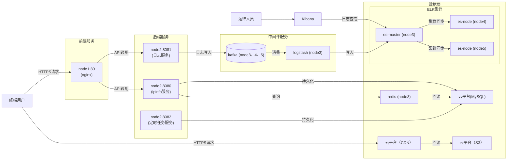

```mermaid
graph LR

    %% 监控展示
    OpsUser[运维人员] --> Kibana
    Kibana -->|日志查看| ES3
    
    %% 外部用户
    User[终端用户] -->|HTTPS请求| CDN

    

    User[终端用户] --> |HTTPS请求| Nginx

    Nginx -->|API调用| IPinfo
    IPinfo -->|持久化| MySQL
    IPinfo -->|查询| Redis
    Redis -->|回源| MySQL

    Nginx -->|API调用| LogServer
    LogServer -->|日志写入| Kafka
    Kafka -->|消费| Logstash
    Logstash -->|写入| ES3


    CronServer -->|持久化| MySQL

    %% 前端层
    subgraph 前端层["前端服务"]
        Nginx["node1:80<br/>(nginx)"]
    end
    
    %% 后端层
    subgraph 后端层["后端服务"]
        IPinfo["node2:8080<br/>(ipinfo服务)"]
        LogServer["node2:8081<br/>(日志服务)"]
        CronServer["node2:8082<br/>(定时任务服务)"]
    end

    %% 中间层
    subgraph 中间层["中间件服务"]
        Kafka[("kafka (node3、4、5)")]
        Logstash["logstash (node3)"]
    end

    %% 数据层
    subgraph 数据处理层["数据层"]
        
        Redis["redis (node3)"]
        MySQL["云平台(MySQL)"]

         %% 数据处理层
        subgraph 日志集群["ELK集群"]
            ES3["es-master (node3)"]
            ES3 -->|集群同步| ES4["es-node (node4)"]
            ES3 -->|集群同步| ES5["es-node (node5)"]
        end

        CDN["云平台（CDN）"] -->|回源| S3["云平台（S3）"]
        
    end

    
```