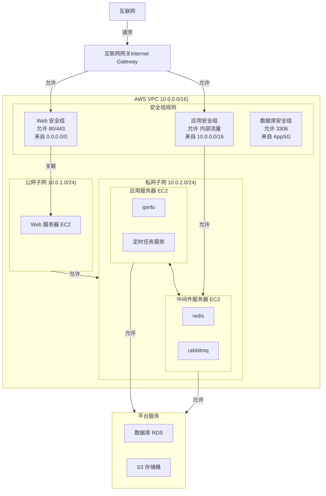

```mermaid
graph TD
    %% 外部网络
    Internet[互联网] -->|请求| IGW[互联网网关Internet Gateway]

    %% VPC 容器
    subgraph VPC["AWS VPC 10.0.0.0/16)"]
        direction LR

        %% 公网子网
        subgraph PublicSubnet["公网子网 10.0.1.0/24)"]
            WebServer[Web 服务器 EC2 ]            
        end

        %% 私网子网
        subgraph PrivateSubnet["私网子网 10.0.2.0/24)"]
            direction LR
            
            %% 后端服务
            subgraph AppServer[应用服务器 EC2 ]
                ipinfo[ipinfo]
                定时任务[定时任务服务]
            end

            %% 中间件服务
            subgraph MiddleServer[中间件服务器 EC2]
                redis[redis] 
                rabbitmq[rabbitmq]
            end
            
        end

        %% 安全组定义
        subgraph SecurityGroups["安全组规则"]
            WebSG[Web 安全组\n允许 80/443\n来自 0.0.0.0/0]
            AppSG[应用安全组\n允许 内部流量\n来自 10.0.0.0/16]
            DBSG[数据库安全组\n允许 3306\n来自 AppSG]
        end 
    end

    
    %% 平台服务
    subgraph Platform["平台服务"]
        Database[数据库 RDS]
        S3[S3 存储桶]
    end


    %% 流量路径
    IGW -->|允许| WebSG
    WebSG -->|关联| WebServer
    PublicSubnet -->|允许| PrivateSubnet
    AppServer -->|允许| Platform
    AppServer <--> MiddleServer


    %% 流量路径
    IGW -->|允许| AppSG
    AppSG -->|允许| MiddleServer
    MiddleServer -->|允许| Platform
    %% 安全组关联
    
    %% 安全组关联

```