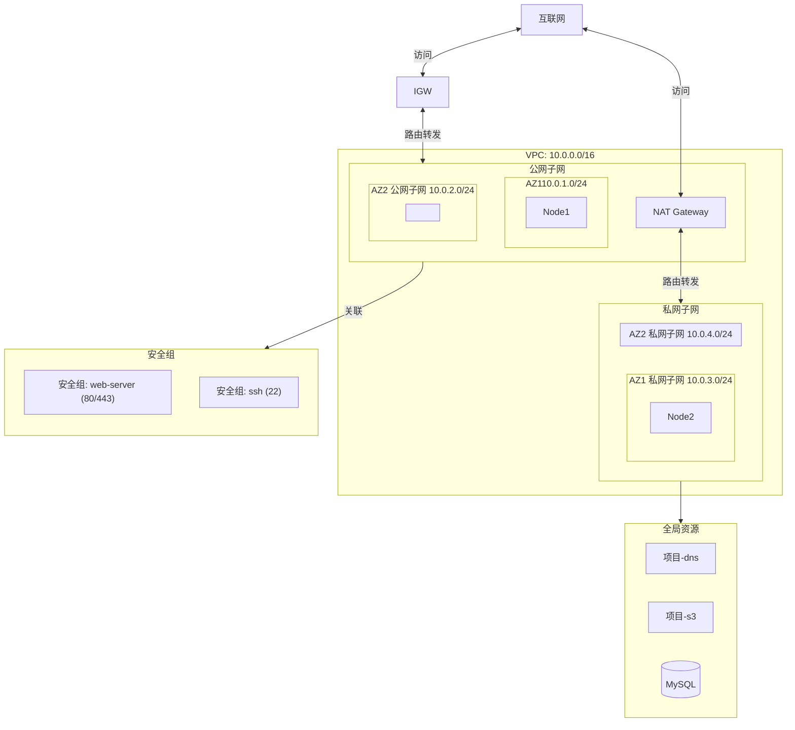

```mermaid
graph TD

    %% 连接关系

    互联网  <-->|访问| IGW  <-->|路由转发| Public 
    Public --> |关联| Security

    互联网  <-->|访问| NAT  <--> |路由转发| Private
    Private --> CloudResources

    %% VPC结构
    subgraph VPC["VPC: 10.0.0.0/16"]
        
        %% 公网子网
        subgraph Public["公网子网"]
            NAT[NAT Gateway]:::gateway

            subgraph PublicAZ1["AZ110.0.1.0/24"]
                    Node1
            end
            subgraph PublicAZ2["AZ2 公网子网 10.0.2.0/24"]
                PlaceholderAZ2[ ]:::invisible
            end
        end 

        %% 私网子网
        subgraph Private["私网子网"]
            subgraph PrivateAZ1["AZ1 私网子网 10.0.3.0/24"]
                Node2
            end
            subgraph PrivateAZ2["AZ2 私网子网 10.0.4.0/24"]
            end
        end
    end
    
    %% 安全组
    subgraph Security["安全组"]
        direction TB
        WebSG["安全组: web-server (80/443)"]:::sg
        SSHSG["安全组: ssh (22)"]:::sg
    end
    

    %% 全局资源
    subgraph CloudResources[全局资源]
        DNS[项目-dns]:::dns
        S3[项目-s3]:::storage
        DB[(MySQL)]:::database
    end


    
```