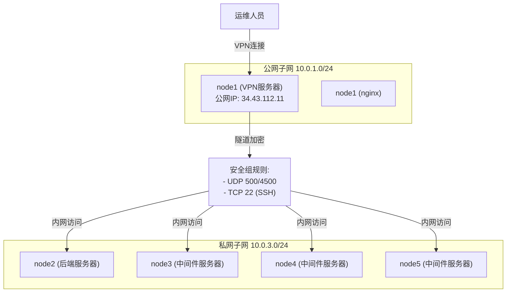
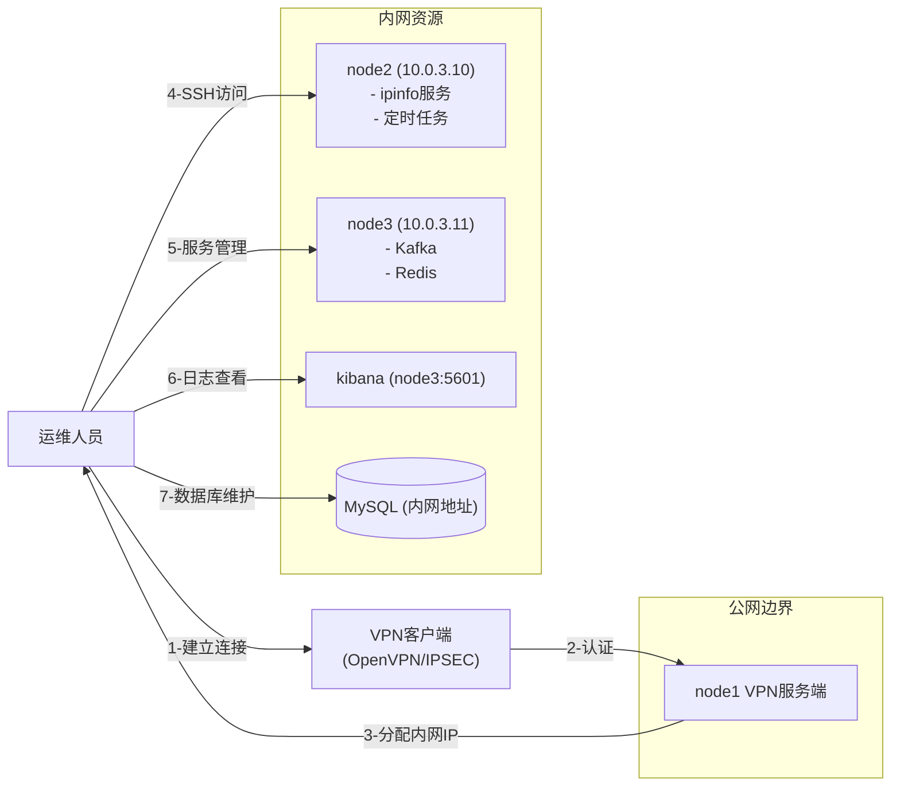

```mermaid
graph TD
    %% 外部实体
    User[运维人员] -->|VPN连接| VPN_Gateway
    
    %% 公网区域
    subgraph 公网子网["公网子网 10.0.1.0/24"]
        VPN_Gateway["node1 (VPN服务器)<br/>公网IP: 34.43.112.11"]:::vpn
        Nginx["node1 (nginx)"]:::public
    end
    
    %% 私网区域
    subgraph 私网子网["私网子网 10.0.3.0/24"]
        Node2["node2 (后端服务器)"]:::private
        Node3["node3 (中间件服务器)"]:::middleware
        Node4["node4 (中间件服务器)"]:::middleware
        Node5["node5 (中间件服务器)"]:::middleware
    end
    
    %% 安全组规则
    VPNSG["安全组规则:<br/>- UDP 500/4500<br/>- TCP 22 (SSH)"]:::sg
    
    %% 连接关系
    VPN_Gateway -->|隧道加密| VPNSG
    VPNSG -->|内网访问| Node2
    VPNSG -->|内网访问| Node3
    VPNSG -->|内网访问| Node4
    VPNSG -->|内网访问| Node5
    
```

```mermaid
graph LR
    %% 访问流程
    User[运维人员] -->|1-建立连接| VPN_Client["VPN客户端<br/>(OpenVPN/IPSEC)"]
    VPN_Client -->|2-认证| VPN_Gateway["node1 VPN服务端"]
    VPN_Gateway -->|3-分配内网IP| User
    User -->|4-SSH访问| Node2
    User -->|5-服务管理| Node3
    User -->|6-日志查看| Kibana
    User -->|7-数据库维护| MySQL
    
    %% 组件说明
    subgraph 公网["公网边界"]
        VPN_Gateway
    end
    
    subgraph 内网["内网资源"]
        Node2["node2 (10.0.3.10)<br/>- ipinfo服务<br/>- 定时任务"]
        Node3["node3 (10.0.3.11)<br/>- Kafka<br/>- Redis"]
        Kibana["kibana (node3:5601)"]
        MySQL[("MySQL (内网地址)")]
    end

```