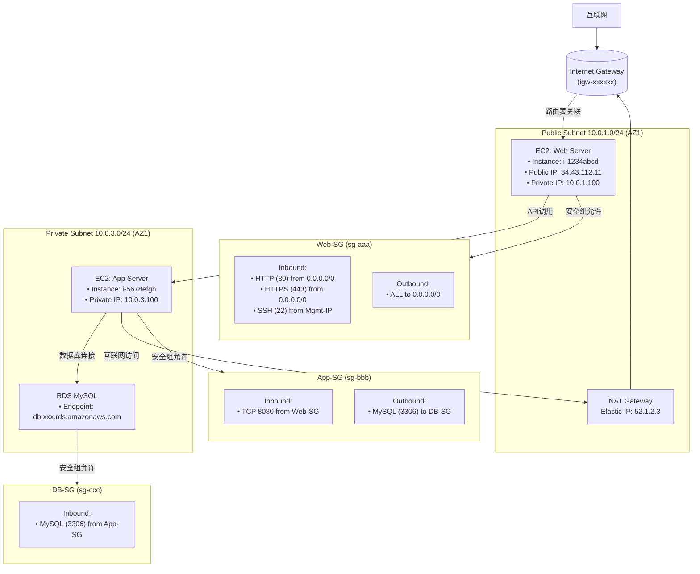

```mermaid
graph TD
    %% ========== 互联网边界 ==========
    Internet[互联网] --> IGW[("Internet Gateway<br/>(igw-xxxxxx)")]:::igw

    %% ========== 公网子网资源 ==========
    subgraph 公网子网["Public Subnet 10.0.1.0/24 (AZ1)"]
        NatGW["NAT Gateway<br/>Elastic IP: 52.1.2.3"]:::nat
        WebServer["EC2: Web Server<br/>• Instance: i-1234abcd<br/>• Public IP: 34.43.112.11<br/>• Private IP: 10.0.1.100"]:::ec2-public
    end

    %% ========== 私网子网资源 ==========
    subgraph 私网子网["Private Subnet 10.0.3.0/24 (AZ1)"]
        AppServer["EC2: App Server<br/>• Instance: i-5678efgh<br/>• Private IP: 10.0.3.100"]:::ec2-private
        DBServer["RDS MySQL<br/>• Endpoint: db.xxx.rds.amazonaws.com"]:::rds
    end

    %% ========== 安全组规则 ==========
    subgraph SG_Web["Web-SG (sg-aaa)"]
        direction TB
        In1["Inbound:<br/>• HTTP (80) from 0.0.0.0/0<br/>• HTTPS (443) from 0.0.0.0/0<br/>• SSH (22) from Mgmt-IP"]:::inbound
        Out1["Outbound:<br/>• ALL to 0.0.0.0/0"]:::outbound
    end

    subgraph SG_App["App-SG (sg-bbb)"]
        direction TB
        In2["Inbound:<br/>• TCP 8080 from Web-SG"]:::inbound
        Out2["Outbound:<br/>• MySQL (3306) to DB-SG"]:::outbound
    end

    subgraph SG_DB["DB-SG (sg-ccc)"]
        direction TB
        In3["Inbound:<br/>• MySQL (3306) from App-SG"]:::inbound
    end

    %% ========== 网络连接 ==========
    IGW -->|路由表关联| WebServer
    WebServer -->|安全组允许| SG_Web
    WebServer -->|API调用| AppServer
    AppServer -->|安全组允许| SG_App
    AppServer -->|数据库连接| DBServer
    DBServer -->|安全组允许| SG_DB
    AppServer -->|互联网访问| NatGW --> IGW

```