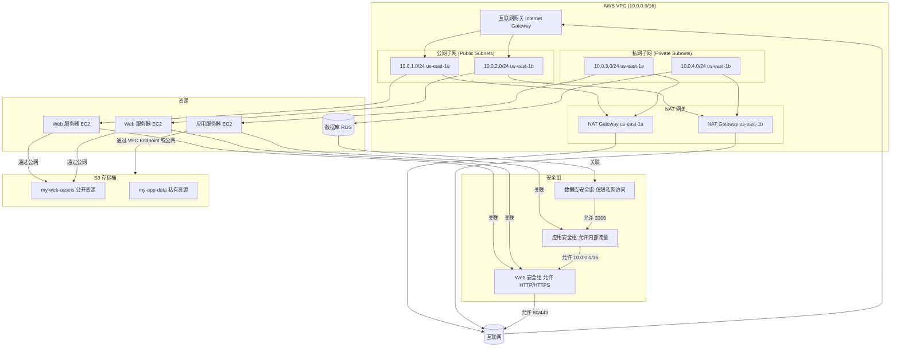

```mermaid
graph TD
    %% VPC 容器
    subgraph VPC["AWS VPC (10.0.0.0/16)"]
        direction TB

        %% 互联网网关 (IGW)
        IGW[互联网网关 Internet Gateway]

        %% 公网子网
        subgraph PublicSubnets["公网子网 (Public Subnets)"]
            direction LR
            PubSub1[10.0.1.0/24 us-east-1a]
            PubSub2[10.0.2.0/24 us-east-1b]
        end

        %% 私网子网
        subgraph PrivateSubnets["私网子网 (Private Subnets)"]
            direction LR
            PriSub1[10.0.3.0/24 us-east-1a]
            PriSub2[10.0.4.0/24 us-east-1b]
        end

        %% NAT 网关
        subgraph NATGateways["NAT 网关"]
            direction LR
            NAT1[NAT Gateway us-east-1a]
            NAT2[NAT Gateway us-east-1b]
        end
    end

    %% 安全组
    subgraph SecurityGroups["安全组"]
        direction LR
        WebSG[Web 安全组 允许 HTTP/HTTPS]
        AppSG[应用安全组 允许内部流量]
        DBSG[数据库安全组 仅限私网访问]
    end

    %% 资源实例
    subgraph Resources["资源"]
        direction TB
        WebServer1[Web 服务器 EC2] -->|关联| WebSG
        WebServer2[Web 服务器 EC2] -->|关联| WebSG
        AppServer[应用服务器 EC2] -->|关联| AppSG
        Database[(数据库 RDS)] -->|关联| DBSG
    end

    %% S3 存储桶（通过 VPC Endpoint 或公网访问）
    subgraph S3["S3 存储桶"]
        direction TB
        Bucket1[my-web-assets 公开资源]
        Bucket2[my-app-data 私有资源]
    end

    %% 互联网流量
    Internet[(互联网)] --> IGW
    IGW --> PubSub1 & PubSub2

    %% 公网子网到私网子网的路由
    PubSub1 --> NAT1
    PubSub2 --> NAT2
    NAT1 --> Internet
    NAT2 --> Internet

    %% 私网子网通过 NAT 访问互联网
    PriSub1 --> NAT1
    PriSub2 --> NAT2

    %% 资源部署位置
    PubSub1 --> WebServer1
    PubSub2 --> WebServer2
    PriSub1 --> AppServer
    PriSub2 --> Database

    %% S3 访问路径
    AppServer -->|通过 VPC Endpoint 或公网| S3
    WebServer1 -->|通过公网| Bucket1
    WebServer2 -->|通过公网| Bucket1

    %% 安全组规则（示意）
    WebSG -->|允许 80/443| Internet
    AppSG -->|允许 10.0.0.0/16| WebSG
    DBSG -->|允许 3306| AppSG

```