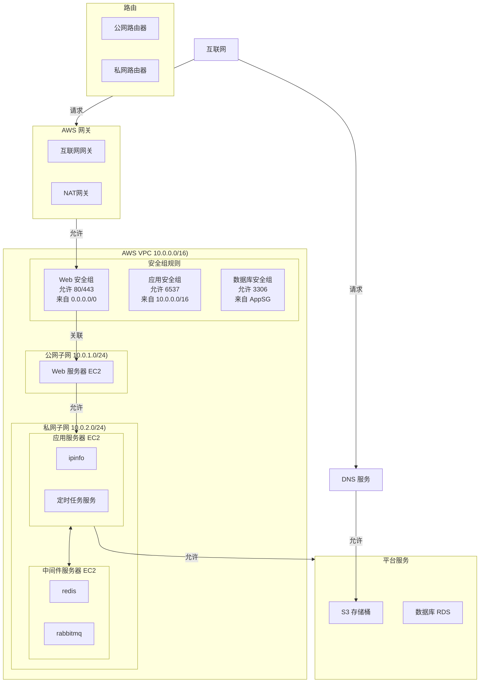

```mermaid
graph TD
    %% 外部网络
    Internet[互联网] -->|请求| IGW[互联网网关Internet Gateway]
    Internet[互联网] -->|请求| DNS[DNS 服务]
    DNS -->|允许| S3
    
    %% 网关
    subgraph IGW["AWS 网关"]
        InternetGateway[互联网网关]
        NetworkGateway[NAT网关]
    end

    %% VPC 容器
    subgraph VPC["AWS VPC 10.0.0.0/16)"]
        direction LR

        %% 公网子网
        subgraph PublicSubnet["公网子网 10.0.1.0/24)"]
            direction LR

            WebServer[Web 服务器 EC2 ]     
        end

        %% 私网子网
        subgraph PrivateSubnet["私网子网 10.0.2.0/24)"]
            direction TB
            
            %% 后端服务
            subgraph AppServer[应用服务器 EC2 ]
                ipinfo[ipinfo]
                定时任务[定时任务服务]
            end
            
            %% 中间件服务
            subgraph MiddleServer[中间件服务器 EC2]
                redis[redis] 
                rabbitmq[rabbitmq]
            end       
        end

        %% 安全组定义
        subgraph SecurityGroups["安全组规则"]
            WebSG[Web 安全组\n允许 80/443\n来自 0.0.0.0/0]
            RedisSG[应用安全组\n允许 6537\n来自 10.0.0.0/16]
            DBSG[数据库安全组\n允许 3306\n来自 AppSG]
        end 
    end

    %% 公网IP


    %% 路由
    subgraph router["路由"]
        PublicRouter[公网路由器]
        PrivateRouter[私网路由器]
    end

    %% 平台服务
    subgraph Platform["平台服务"]
        Database[数据库 RDS]
        S3[S3 存储桶]
    end


    
    
    %% 内网访问
    AppServer -->|允许| Platform
     

    %% 流量路径
    IGW -->|允许| WebSG
    WebSG -->|关联| WebServer
    %% RedisSG -->|关联| redis
    WebServer -->|允许| AppServer
    %% AppServer -->|允许| Platform
    AppServer <--> MiddleServer


    %% 流量路径
    %% IGW -->|允许| AppSG
    %% AppSG -->|允许| MiddleServer
    %% MiddleServer -->|允许| Platform
    %% 安全组关联
    
    %% 安全组关联

```