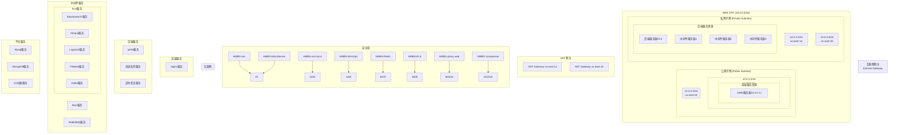

```mermaid

graph TD
    
    direction TB
    %% VPC 容器
    subgraph VPC["AWS VPC (10.0.0.0/16)"]
       
        %% 公网子网
        subgraph PublicSubnets["公网子网 (Public Subnets)"]
            <!-- direction TB -->
            subgraph PubSub1[10.0.1.0/24\nus-east-1a]
                %% 前端服务资源实例
                subgraph FrontendResources["前端服务资源"]
                    node1[（Web服务器10.0.0.1）]
                end
            end
            subgraph PubSub2[10.0.2.0/24\nus-east-1b]
            end
        end

        %% 私网子网
        subgraph PrivateSubnets["私网子网 (Private Subnets)"]
            <!-- direction TB -->
            PriSub1[10.0.3.0/24\nus-east-1a]
            PriSub2[10.0.4.0/24\nus-east-1b]
            %% 后端服务资源实例
            subgraph BackendResources["后端服务资源"]
                direction TB
                backd-end-node1[后端服务器EC2 ]
                
                middle-master[中间件服务器1]
                middle-node1[中间件服务器2]
                middle-node2[中间件服务器3]
            end
        end

    end

    %% 互联网网关 (IGW)
    IGW[互联网网关\nInternet Gateway]

    %% NAT 网关 (每个私网子网对应一个 NAT 网关)
    subgraph NATGateways["NAT 网关"]
        <!-- direction TB -->
        NAT1[NAT Gateway us-east-1a]
        NAT2[NAT Gateway us-east-1b]
    end
    

    %% 安全组 (独立于子网，作用于资源)
    subgraph SecurityGroups["安全组"]
        direction TB
        HMBS-proxy-web-->80/443
        HMBS-ssh-->22
        HMBS-Jumpserver-->22/2222
        HMBS-Redis--> 6379
        HMBS-ssh-local --> 1033
        HMBS-WireVpn --> 1194
        HMBS-MicroServer --> 22
        HMBS-ELK --> 9200
    end

    %% 互联网
    subgraph Internet["互联网"]
    end

    
    %% 前端服务
    subgraph frontend["前端服务"]
        nginx[Nginx服务]
    end 

    %% 后端服务
    subgraph backend["后端服务"]
        IPinfo[ipinfo服务]
        queue[消息队列服务]
        定时任务[定时任务服务]
    end 

    %% 中间件服务
    subgraph middleServer["中间件服务"]
        direction LR
    
        redis[Riss服务]
        rabbmitmq[RabbitMQ服务]

        subgraph elk["ELK服务"]
            direction LR

            elasticsearch[Elasticsearch服务]
            kibana[Kibana服务]
            logstash[Logstash服务]
            filebeat[Filebeat服务]
            kafka[Kafka服务]
        end
    end

    %% 平台服务
    subgraph awsCloudService["平台服务"]
        Mysql[Mysql服务]
        MongoDB[MongoDB服务]
        s3[S3对象服务]
    end 

```